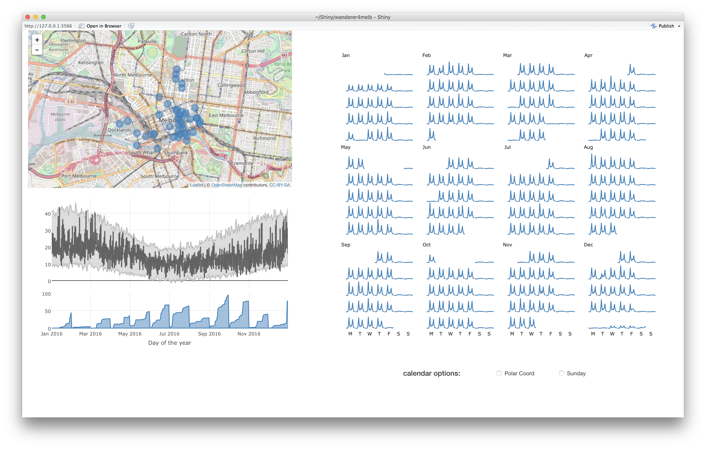

```{r initial, echo = FALSE, cache = FALSE, results = 'hide'}
library(knitr)
options(htmltools.dir.version = FALSE, tibble.width = 60)
opts_chunk$set(
  echo = FALSE, warning = FALSE, message = FALSE, comment = "#>",
  fig.path = 'figure/', cache.path = 'cache/', fig.align = 'center', 
  fig.width = 12, fig.height = 9, fig.show = 'hold', 
  cache = TRUE, external = TRUE, dev = 'CairoPNG', dpi = 300
)
read_chunk('src/code.R')
```

## Agenda

* Why `tidyverse`? Tidy data
* What does `gg` in `ggplot2` stand for? A grammar of graphics
* How do we know if what we see really is there? Visual statistical inference
* Interactive data visualisation on the web
    + plotly: `ggplotly()`, `plot_ly`, animation
    + shiny app: `wanderer4melb`

```{r load-library}
```

```{r theme-remark}
```
---

class: inverse middle center

# Tidy data

---

class: middle

## What is tidy data?

* Each variable forms a column.
* Each observation forms a row.
* Each type of observational unit forms a table.

---

.left-column[
## Melbourne pedestrian data .red[*]
### - sensor data
]
.right-column[

```{r ped-loc, echo = TRUE}
```

.footnote[.red[*] source: [the city of Melbourne](http://www.pedestrian.melbourne.vic.gov.au)]
]

---

.left-column[
## Melbourne pedestrian data .red[*]
### - sensor data
### - sensor map
]
.right-column[

```{r ped-map}
```
]

---

.left-column[
## Melbourne pedestrian data .red[*]
### - sensor data
### - sensor map
### - hourly counts
]
.right-column[

```{r ped-wide, echo = TRUE}
```
]

---

.left-column[
## Melbourne pedestrian data .red[*]
### - sensor data
### - sensor map
### - hourly counts
### - `autoplot`
]
.right-column[

```{r ped-ts-show, echo = TRUE, eval = FALSE}
ped_ts <- ts(ped_2017[, -c(1, 2)], frequency = 24)
selected_id <- c(1, 10, 18, 19, 24)
sub_ped_ts <- ped_ts[, selected_id]
autoplot(sub_ped_ts, facet = TRUE)
```

```{r ped-ts, fig.height = 10}
```
]

---

.left-column[
## Melbourne pedestrian data .red[*]
### - sensor data
### - sensor map
### - hourly counts
### - `autoplot`
### - issues?
]
.right-column[
From the tidy data in the wide format,

* how to join the pedestrian sensor locations by the sensor names?
* how to retrieve the temporal components and plot the sub-series b/t weekdays
  & weekends?
]

---

.left-column[
## Melbourne pedestrian data .red[*]
### - sensor data
### - sensor map
### - hourly counts
### - `autoplot`
### - issues?
### - tidy data
]
.right-column[

```{r ped-long, echo = TRUE}
```

p.s. `tidyr::spread` makes it easy to switch "long" back to "wide":

```{r ped-spread, echo = TRUE, eval = FALSE}
ped_long %>%
  spread(Sensor_Name, Counts)
```

]

---

.left-column[
## Otway weather data .red[*]
### - what variables?
]
.right-column[

```{r otway-weather, echo = TRUE}
```
.footnote[.red[*] source: [global historical climatology network](https://www1.ncdc.noaa.gov/pub/data/ghcn/daily/gsn/)]
]

---

.left-column[
## Otway weather data .red[*]
### - what variables?
### - tidying
]
.right-column[
```{r otway-tidy-1, echo = TRUE}
```
]

---

.left-column[
## Otway weather data .red[*]
### - what variables?
### - tidying
]
.right-column[
```{r otway-tidy-2, echo = TRUE}
```
]

---

.left-column[
## Otway weather data .red[*]
### - what variables?
### - tidying
]
.right-column[
```{r otway-tidy-3, echo = TRUE}
```
]

---

.left-column[
## Otway weather data .red[*]
### - what variables?
### - tidying
]
.right-column[
```{r otway-tidy, echo = TRUE}
```
]

---

class: inverse middle center

# A grammar of graphics

---

class: middle

## What is a grammar of graphics?

* A conceptual framework for mapping data to graphical form
* The analogue of doing a functional mapping of random variables. For example,
  $n$ independent and identically distributed RVs $X_1, \ldots, X_n$, the mean
  is defined as 
  $$\bar{X} = \frac{1}{n} \sum_{i = 1}^{n} X_{i}.$$

---

.left-column[
## More on pedestrian data
### - `ggplot2`
]
.right-column[

```
data: ped_long
layer:
    mapping: x = Date_Time, y = Counts
    geom: line
facet: Sensor_Name
```

```{r ped-ggplot-1}
```
]

---

.left-column[
## More on pedestrian data
### - `ggplot2`
]
.right-column[

```
data: ped_long
layer:
    mapping: x = Date_Time, y = Counts, colour = Sensor_Name
    geom: line
facet: Sensor_Name
```

```{r ped-ggplot-2}
```

]

---

.left-column[
## More on pedestrian data
### - `ggplot2`
### - southern x
]
.right-column[

```{r southern-x, echo = TRUE}
```

]

---

.left-column[
## More on pedestrian data
### - `ggplot2`
### - southern x
]
.right-column[

```
data: southern-cross
layer:
    mapping: x = Hour, y = Counts, colour = Wday
    geom: line
```

```{r x-colour, fig.height = 7}
```

]

---

.left-column[
## More on pedestrian data
### - `ggplot2`
### - southern x
]
.right-column[

```
data: southern-cross
layer:
    mapping: x = Hour, y = Counts
    geom: line
facet: Wday
```

```{r x-facet, fig.height = 6}
```

]

---

.left-column[
## More on pedestrian data
### - `ggplot2`
### - southern x
]
.right-column[

```{r x-more, echo = TRUE}
```

]

---

.left-column[
## More on pedestrian data
### - `ggplot2`
### - southern x
]
.right-column[

```
data: southern-cross-more
layer:
    mapping: x = Hour, y = Counts
    geom: line
facet: Wday
```

```{r x-more-p}
```

]

---

.left-column[
## More on pedestrian data
### - `ggplot2`
### - southern x
]
.right-column[

```
data: southern-cross-more
layer:
    mapping: x = Hour, y = Counts
    geom: line
facet: Wday
coord: polar
```

```{r x-polar}
```

]

---

.left-column[
## Your turn
### - weather data
]
.right-column[
```{r otway-more, echo = TRUE}
```
]

---

.left-column[
## Your turn
### - weather data
### - grammar here?
]
.right-column[
```{r otway-month-a, fig.height = 11}
```
]

---

.left-column[
## Your turn
### - weather data
### - grammar here?
### - it's ...
]
.right-column[

```
data: otway_more
layer:
    1. yintercept: year_average
       geom: hline
    2. mapping: xmin = DAY-, xmax = DAY+, ymin = TMIN, ymax = TMAX
       geom: rect
    3. mapping: x = DAY, y = TAVG
       geom: line
facet: MONTH
```

```{r otway-month-b, fig.height = 8}
```
]

---

class: inverse middle center

# Visual statistical inference

---

---

## Workflow

---

class: inverse middle center

# Interactive data visualisation <br> on the web

---

.left-column[
## plotly
### - `ggplotly`
]
.right-column[
```{r ggplotly-sx-facet, echo = TRUE, fig.height = 4.5, fig.width = 8, dpi = 72}
```
]

---

.left-column[
## plotly
### - `ggplotly`
### - `plot_ly`
]
.right-column[
```{r plotly-sx-facet, echo = TRUE, fig.height = 4.5, fig.width = 8, dpi = 72}
```
]

---

.left-column[
## plotly
### - `ggplotly`
### - `plot_ly`
### - animation
]
.right-column[
```{r animate, echo = TRUE, fig.height = 4, fig.width = 8, dpi = 72}
```
]

---

.left-column[
## bind all together
### - shiny app
]
.right-column[

[`wanderer4melb`](https://github.com/earowang/wanderer4melb) is a shiny app for 
visualising Melbourne pedestrian and weather data in 2016.



```r
# install.packages("devtools")
devtools::install_github("earowang/wanderer4melb")
wanderer4melb::launch_app()
```

]

---

.left-column[
## bind all together
### - shiny app
### - calendar plots
]
.right-column[
]

---

class: inverse middle center

# More?

---

## Acknowledgements

* Slides powered by the R package [xaringan](https://github.com/yihui/xaringan)
  for [remark.js](https://remarkjs.com/) and [R Markdown](https://rmarkdown.rstudio.com)
    + The source files to reproduce the slides are available [here](https://github.com/earowang/medascin17-tsvis).
    + Yihui is giving a tutorial on [R Markdown Ecosystem](http://www.datasciencemelbourne.com/medascin2017/session/r-markdown-ecosystem-reports-papers-dashboards-books-websites-and-presentations/) (check it out).
* The R packages used for the slides to make analysis easier and more fun: `ggmap`,
  `plotly`, `stringr`, `forcats`, `forecast`, `tidyverse`, `lubridate`, `broom`,
  `zoo`, `shiny`
