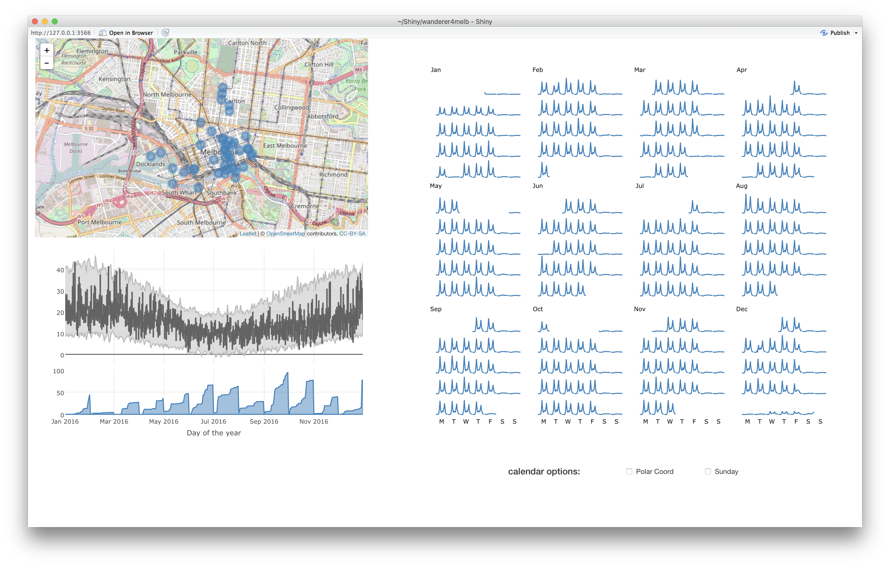

```{r initial, echo = FALSE, cache = FALSE, results = 'hide'}
library(knitr)
options(htmltools.dir.version = FALSE, tibble.width = 60)
opts_chunk$set(
  echo = FALSE, warning = FALSE, message = FALSE, comment = "#>",
  fig.path = 'figure/', cache.path = 'cache/', fig.align = 'center', 
  fig.width = 12, fig.height = 9, fig.show = 'hold', 
  cache = TRUE, external = TRUE, dev = 'CairoPNG', dpi = 300
)
read_chunk('src/code.R')
```

## Agenda

* Why `tidyverse`? Tidy data


* What does `gg` in `ggplot2` stand for? Grammar of graphics


* Interactive data visualisation on the web
    + plotly: `ggplotly()`, `plot_ly`, animation
    + shiny app: `wanderer4melb`

---

## R packages

* `tidyverse`: a collection of R packages surrounding "tidy data"
* `stringr`: handle string manipulation
* `forcats`: handle categorical variables
* `lubridate`: lubricate date-times process
* `plotly`: create web-based visualisation
* `shiny`: build interactive web applications
* `knitr`: provide tools for dynamic report generation
* `devtools`: help with R packages development

```{r load-library}
```

```{r theme-remark}
```
---

class: inverse middle center

# Tidy data

---

class: middle

## What is tidy data?

* Each variable forms a column.
* Each observation forms a row.
* Each type of observational unit forms a table.

???

tidyverse assumes the underlying data structure is a rectangular cases-by-variables
data layout.

---

.left-column[
## Melbourne pedestrian data `r emo::ji("walking_woman")`
### - sensor data
]
.right-column[

```{r ped-loc, echo = TRUE}
```

.footnote[.red[*] source: [the city of Melbourne](http://www.pedestrian.melbourne.vic.gov.au)]
]

---

.left-column[
## Melbourne pedestrian data `r emo::ji("walking_woman")`
### - sensor data
### - sensor map
]
.right-column[

```{r ped-map}
```
]

---

.left-column[
## Melbourne pedestrian data `r emo::ji("walking_woman")`
### - sensor data
### - sensor map
### - hourly counts
]
.right-column[

```{r ped-wide, echo = TRUE}
```
]

---

.left-column[
## Melbourne pedestrian data `r emo::ji("walking_woman")`
### - sensor data
### - sensor map
### - hourly counts
### - `autoplot`
]
.right-column[

```r
ped_ts <- ts(ped_2017[, -c(1, 2)], frequency = 24)
selected_id <- c(1, 10, 18, 19, 24)
sub_ped_ts <- ped_ts[, selected_id]
autoplot(sub_ped_ts, facet = TRUE)
```

```{r ped-ts, fig.height = 10}
```
]

---

.left-column[
## Melbourne pedestrian data `r emo::ji("walking_woman")`
### - sensor data
### - sensor map
### - hourly counts
### - `autoplot`
### - pros & cons
]
.right-column[

A `ts` object associates with a `tsp` attribute as metadata.

```{r ped-ts-1, echo = TRUE}
```

.pull-left[
**Pros:**

* to automatically create the index variable for equally spaced time series
* to retrieve the structure of information at run time for specialist methods
  (e.g. `auto.arima` or `ets`)
]
.pull-right[
**Cons:**

* hard to add other complementary variables (e.g. longitudes and latitudes) 
  to the data
* hard to dissect temporal components and examine different seasonal patterns 
  (e.g. b/t weekdays & weekends)
]
]

???

hard to handle missing values

---

.left-column[
## Melbourne pedestrian data `r emo::ji("walking_woman")`
### - sensor data
### - sensor map
### - hourly counts
### - `autoplot`
### - pros & cons
### - tidy data
]
.right-column[

```{r ped-long, echo = TRUE}
```

]

---

.left-column[
## Otway weather data `r emo::ji("sunny")`
### - what variables?
]
.right-column[

```{r otway-weather, echo = TRUE}
```
.footnote[.red[*] source: [global historical climatology network](https://www1.ncdc.noaa.gov/pub/data/ghcn/daily/gsn/)]
]

---

.left-column[
## Otway weather data `r emo::ji("sunny")`
### - what variables?
### - tidying `r emo::ji("hammer_and_wrench")`
]
.right-column[
```{r otway-tidy-1, echo = TRUE}
```
]

---

.left-column[
## Otway weather data `r emo::ji("sunny")`
### - what variables?
### - tidying `r emo::ji("hammer_and_wrench")`

]
.right-column[
```{r otway-tidy-2, echo = TRUE}
```
]

---

.left-column[
## Otway weather data `r emo::ji("sunny")`
### - what variables?
### - tidying `r emo::ji("hammer_and_wrench")`

]
.right-column[
```{r otway-tidy-3, echo = TRUE}
```
]

---

.left-column[
## Otway weather data `r emo::ji("sunny")`
### - what variables?
### - tidying `r emo::ji("hammer_and_wrench")`

]
.right-column[
```{r otway-tidy, echo = TRUE}
```
]

---

class: inverse middle center

# A grammar of graphics

---

class: middle

## What is a grammar of graphics?

* In 1999, "The grammar of graphics" by Leland Wilkinson
* In 2008, `ggplot2` by Hadley Wickham
* A conceptual framework for mapping variables to graphical elements
* The analogue of doing a functional mapping of random variables. For example,
  $n$ independent and identically distributed RVs $X_1, \ldots, X_n$, the mean
  is defined as 
  $$\bar{X} = \frac{1}{n} \sum_{i = 1}^{n} X_{i} \qquad S_{n-1} = \frac{1}{n-1} \sum_{i = 1}^{n} \left(X_i - \bar{X} \right)^2.$$

---

.left-column[
## More on pedestrian data
### - `ggplot2`
]
.right-column[

```
data: ped_long
layer:
    mapping: x = Date_Time, y = Counts
    geom: line
facet: Sensor_Name
```

```{r ped-ggplot-1, fig.height = 8}
```

```r
ggplot(ped_long, aes(x = Date_Time, y = Counts)) +
  geom_line() +
  facet_grid(Sensor_Name ~ ., scale = "free_y")
```
]


???

as you can see, it provides short but comprehensive vocabulary for describing a plot.

---

.left-column[
## More on pedestrian data
### - `ggplot2`
]
.right-column[

```
data: ped_long
layer:
    mapping: x = Date_Time, y = Counts, colour = Sensor_Name
    geom: line
facet: Sensor_Name
```

```{r ped-ggplot-2, fig.height = 8}
```

```r
ggplot(ped_long, aes(x = Date_Time, y = Counts)) +
  geom_line(aes(colour = Sensor_Name)) +
  facet_grid(Sensor_Name ~ ., scale = "free_y")
```
]

---

.left-column[
## More on pedestrian data
### - `ggplot2`
### - southern x `r emo::ji("station")`
]
.right-column[

```{r southern-x, echo = TRUE}
```

]

---

.left-column[
## More on pedestrian data
### - `ggplot2`
### - southern x `r emo::ji("station")`
]
.right-column[

```
data: southern-cross
layer:
    mapping: x = Hour, y = Counts, colour = Wday
    geom: line
```

```{r x-colour, fig.height = 7}
```

```r
ggplot(sx, aes(Hour, Counts, group = Date)) +
  geom_line(aes(colour = Wday))
```

]

---

.left-column[
## More on pedestrian data
### - `ggplot2`
### - southern x `r emo::ji("station")`
]
.right-column[

```
data: southern-cross
layer:
    mapping: x = Hour, y = Counts
    geom: line
facet: Wday
```

```{r x-facet, fig.height = 6}
```

```r
ggplot(sx, aes(Hour, Counts, group = Date)) +
  facet_wrap(~ Wday, ncol = 2)
```
]

---

.left-column[
## More on pedestrian data
### - `ggplot2`
### - southern x `r emo::ji("station")`
]
.right-column[

```{r x-more, echo = TRUE}
```

]

---

.left-column[
## More on pedestrian data
### - `ggplot2`
### - southern x `r emo::ji("station")`
]
.right-column[

```
data: southern-cross-more
layer:
    mapping: x = Hour, y = Counts
    geom: line
facet: Wday
```

```{r x-more-p, fig.height = 8.5}
```

```r
ggplot(sx_more, aes(Hour, Counts, group = Date)) +
  facet_wrap(~ Wday, ncol = 2)
```
]

---

.left-column[
## More on pedestrian data
### - `ggplot2`
### - southern x `r emo::ji("station")`
]
.right-column[

```
data: southern-cross-more
layer:
    mapping: x = Hour, y = Counts
    geom: line
facet: Wday
coord: polar
```

```{r x-polar, fig.height = 8}
```

```r
ggplot(sx_more, aes(Hour, Counts, group = Date)) +
  facet_wrap(~ Wday, ncol = 2) +
  coord_polar()
```
]

---

.left-column[
## Your turn
### - weather data
]
.right-column[
```{r otway-more, echo = TRUE}
```
]

---

.left-column[
## Your turn
### - weather data
### - grammar here?
]
.right-column[
```{r otway-month-a, fig.height = 11}
```
]

---

.left-column[
## Your turn
### - weather data
### - grammar here?
### - it's ...
]
.right-column[

```
data: otway_more
layer:
    1. yintercept: year_average
       geom: hline
    2. mapping: xmin = DAY-, xmax = DAY+, ymin = TMIN, ymax = TMAX
       geom: rect
    3. mapping: x = DAY, y = NAVG
       geom: line
facet: MONTH
```

```{r otway-month-b, fig.height = 8}
```
]

---

## Workflow

---

class: inverse middle center

# Interactive data visualisation <br> on the web

---

.left-column[
## plotly
### - `ggplotly`
]
.right-column[
```{r ggplotly-sx-facet, echo = TRUE, fig.height = 4.5, fig.width = 8, dpi = 72}
```
]

---

.left-column[
## plotly
### - `ggplotly`
### - `plot_ly`
]
.right-column[
```{r plotly-sx-facet, echo = TRUE, fig.height = 4.5, fig.width = 8, dpi = 72}
```
]

---

.left-column[
## plotly
### - `ggplotly`
### - `plot_ly`
### - animation
]
.right-column[

```r
a10_df <- broom::tidy(zoo::as.zoo(fpp2::a10)) %>% 
  mutate(
    year = year(index),
    month = month(index)
  )
p3 <- a10_df %>% 
  ggplot(aes(month, value)) +
  geom_line(aes(group = year), alpha = 0.2) +
  geom_line(aes(frame = year, colour = as.factor(year))) +
animation_opts(
  ggplotly(p3), frame = 1000, easing = "elastic"
)
```

```{r animate, echo = FALSE, fig.height = 4.5, fig.width = 8, dpi = 72}
```
]

---

.left-column[
## bind all together
### - shiny app
]
.right-column[

`wanderer4melb`([click me](https://github.com/earowang/wanderer4melb)) is a shiny app for 
visualising Melbourne pedestrian and weather data in 2016.



```r
# install.packages("devtools")
devtools::install_github("earowang/wanderer4melb")
wanderer4melb::launch_app()
```

]

---

.left-column[
## bind all together
### - shiny app
### - sugrrants
]
.right-column[

`sugrrants` `r emo::ji("ant")` is an R package (under development) that supports 
graphics for analysing time series data.

```r
devtools::install_github("earowang/sugrrants")
library(sugrrants)
```

* It fits into the tidyverse and grammar of graphics suite of methods for exploring
  temporal data.
* Calendar-based graphics are useful for visualising people's daily schedules, and
  `frame_calendar` `r emo::ji("spiral_calendar")` is made available for this.

If you find a bug or wanna suggest a new feature, please report/propose it on 
the [Github page](https://github.com/earowang/sugrrants/issues). Thanks.

]

---

.left-column[
## bind all together
### - shiny app
### - sugrrants
### - calendar plot
]
.right-column[

`frame_calendar` rearranges the data into a calendar format using linear algebra tools.

```{r calendar-df, echo = TRUE}
```

]

---

.left-column[
## bind all together
### - shiny app
### - sugrrants
### - calendar plot
]
.right-column[

`ggplot2` takes care of plotting a `data.frame` or `tibble` as usual.

```{r calendar-ggplot, echo = TRUE}
```

]

---

.left-column[
## bind all together
### - shiny app
### - sugrrants
### - calendar plot
]
.right-column[

`prettify` takes a `ggplot` object and then makes the calendar plot more readable.

```{r calendar-prettify, echo = TRUE}
```

]

---

class: inverse middle center

# Done! `r emo::ji("tada")` `r emo::ji("confetti_ball")` hmm... not yet?

---

class: middle

## Acknowledgements

* Slides powered by the R package [xaringan](https://github.com/yihui/xaringan)
  for [remark.js](https://remarkjs.com/) and [R Markdown](https://rmarkdown.rstudio.com)
    + The source files to reproduce the slides are available [here](https://github.com/earowang/medascin17-tsvis).
    + Yihui is giving a tutorial on [R Markdown Ecosystem](http://www.datasciencemelbourne.com/medascin2017/session/r-markdown-ecosystem-reports-papers-dashboards-books-websites-and-presentations/) (check it out).
* The R packages used for the slides to make analysis easier and more fun: `ggmap`,
  `plotly`, `stringr`, `forcats`, `forecast`, `tidyverse`, `lubridate`, `broom`,
  `zoo`, `shiny`, `emo`

---

class: inverse middle center

# This work is licensed under <br> [<i class="fa fa-creative-commons" aria-hidden="true"></i> Creative Commons](https://creativecommons.org/licenses/by-nc-nd/3.0/us/)
